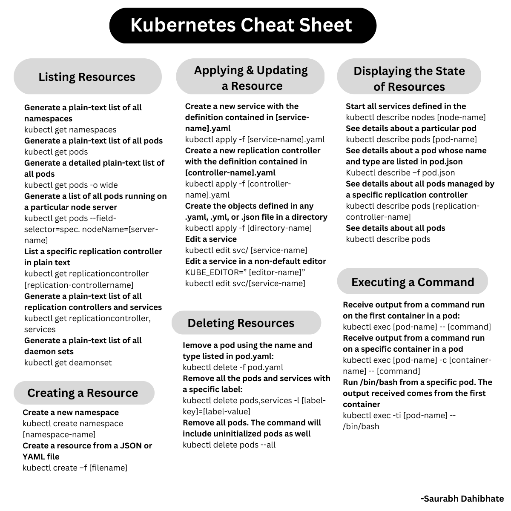
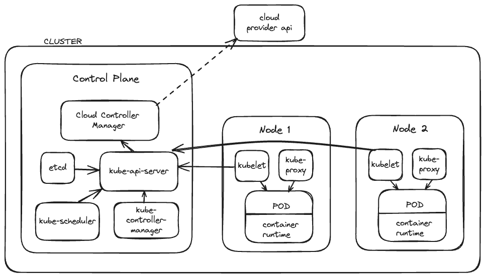

# Kubernetes CLI CheatSheet

## Cluster Architecture

- A set of virtual/physical machines
- In a full production environment, we have several machines running workloads simultaneously to create reliable and scalable architecture
- To coordinate cluster functionalities, there are `Control Plane` responsible for cluster management, and `node components`, that communicates with the `Control Plane` and execute tasks in the worker machines

1. `Control Plane`:
   1. **kube-apiserver**
      1. The "frontend" of the control plane
      2. API that will interact with Kubernetes
      3. Sends instructions to the cluster
      4. Gets data from the cluster
   2. **etcd**
      1. Distributed key-value database
      2. Persists all cluster data and state
      3. backing store for the Kubernetes API server
   3. **kube-scheduler**
      1. Distributes work, or containers across multiple nodes.
      2. Watches for newly created pods that are not assigned to any node and selects a node for them to run on
   4. **kube-controller-manager**
      1. Regulates behavior in the cluster, such as node controllers, job controllers, endpointslice controllers, service account controllers. 
      2. Controllers reconcile desired state with the current state
   5. **cloud-controller-manager**
      1. Interacts with cloud providers and sets up cloud-based networking services (routs, load balancers)
      2. Separates components that runs in cloud from the ones that run inside the cluster
2. `Node Components`:
   1. **container runtime**
      1. software responsible for running containers
      2. most common are docker and containerd
   2. **kubelet**
      1. primary node agent that watches the assigned pods and ensures containers are running and healthy
   3. **kube-proxy**
      1. network proxy and load balancer that implements kubernetes networking services on each node

## Pods
- Smallest execution Unit, represents a single instance of an application
- Encapsulates one or more apps
- Contains one or more containers
- Inside a pod you can have a lot of containers (dockers). If a pod dies, all containers are transferred to other nodes
- When multiple containers live inside a pod, they are guaranteed to be co-located on the same node and can share resources
- Containers within the same pod can communicate over localhost and share
resources such as volumes.
- Pods are the units that get deployed, scaled, and managed in Kubernetes. You don’t directly create or manage the containers within pods. This entire process is fully automated.
- Usually, you do not define pods directly. Pods can be created and managed though other resources such as deployments, jobs, and StatefulSets. Nevertheless, you can define a pod with a proper YAML file manifest.
- `Manifests` are the basic way of telling Kubernetes about the desired state of any object or giving it instructions about how to act or deploy anything. It is written as a `.yaml` file. 

## Deployments

- Provide a declarative way to manage pods and replicas
- Defines the desired state for your application, including `container image`, `number of replicas`, `resource limites`, and more.
- The `Control Planes` works to match the actual state desired in the deployment
- Also `.yaml` file.

## StatefulSets
- Used to manage stateful applications such as databases
- Similar to deployments but designed to handle stateful workloads that require persistent storage and unique network identifiers
- StatefulSets operate by creating `PersistentVolumes` for each Pod to mount. This ensures data persists across Pod restarts

## Jobs
- Used to run batch process that run to completion
- Terminates when batch process finishes
- A job creates one or more pods that run a defined workload and then terminates when the workload is complete 

## Services
- Services provide stable endpoints to access pods running in a cluster, thus exposing our applications to users online.
-  They allow pods to die and replicate without interrupting access to the applications running in those pods.
-   There are several types of services in Kubernetes like ClusterIP, NodePort, and load balancer.

## Ingress and ingress controllers
- An Ingress resource defines rules for external connectivity to Kubernetes services.
-  It enables inbound HTTP and HTTPS connections to reach services running within the cluster.
-   Traffic routing is controlled by rules defined on the `Ingress` resource. For an ingress to be able to run, you need to have a running `ingress controller` on Kubernetes.
- An Ingress controller is responsible for fulfilling the Ingress, usually with a load balancer. It watches for Ingress resources and configures the load balancer accordingly. Different load balancers require different Ingress controller implementations.
## Gateway

- The Gateway API is a Kubernetes API that provides a way to dynamically configure load balancing and service mesh capabilities on Kubernetes.
-  The Gateway API allows defining routes and policies to manage external traffic to Kubernetes services in a centralized, declarative way.

## Persistent volumes
When designing storage infrastructure on Kubernetes, there are two main resources to
understand: PersistentVolumes (PVs) and PersistentVolumeClaims (PVCs). A PV represents a
networked storage unit provisioned by the cluster administrator. Much like compute nodes, PVs become a pool of cluster resources. In contrast, PVCs allow end users to request abstract storage with defined capacity and access modes. The PVC functions similarly to a pod resource request, but instead of CPU and memory, users can specify their desired volume size and read/write permissions.

## ConfigMaps and Secrets

ConfigMaps provide a convenient way to pass configuration data into pods in a declarative manner. They allow you to store configuration information without putting them directly in a pod definition or
container image. Pods can access the data stored in a ConfigMap through environment variables, command-line arguments, or by mounting the ConfigMap as a volume. Using ConfigMaps enables you to separate your configuration data from your application code.

A Secret is an object that contains a small amount of sensitive data such as passwords, tokens, or keys. Secrets allow you to store and manage this sensitive data without exposing it in your application code.

