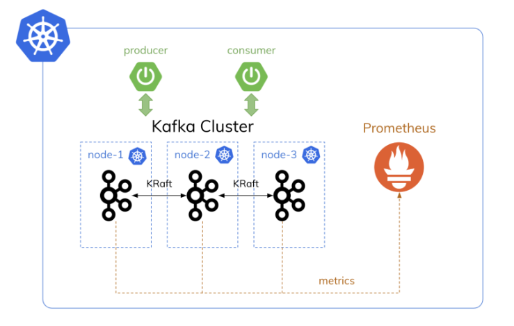

tutorial summarized from: https://piotrminkowski.com/2023/11/06/apache-kafka-on-kubernetes-with-strimzi/

We need a Kubernetes cluster, that should have at least three worker nodes.
We will have kafka brokers apread across nodes..

We will use `kind` to set the cluster locally.

```
kind: Cluster
apiVersion: kind.x-k8s.io/v1alpha4
nodes:
- role: control-plane
- role: worker
- role: worker
- role: worker
- role: worker


```

Then we run

`kind create cluster --name c1 --config manifests/cluster.yaml`

`kind delete cluster --name c1` (if needed for later) - don't do it now.


`kubectl get node`


Architectural constraints:

- It should automatically expose broker metrics in the Prometheus format. Then we will use Prometheus mechanisms to get the metrics and store them for visualization.
- It should consist of at least 3 brokers. Each broker has to run on a different Kubernetes worker node.
- Our Kafka needs to work in the Zookeeper-less mode. Therefore, we need to enable the KRaft protocol between the brokers.
- Once we scale up the Kafka cluster, we must automatically rebalance it to reassign partition replicas to the new broker. In order to do that, we will use the Cruise Control support in Strimzi.



**Install prometheus stack on kubernetes**

We are going to install `kube-prometheus-stack` helm chart.

```
helm repo add prometheus-community \
    https://prometheus-community.github.io/helm-charts
```


install the chart in the monitoring namespace

```
helm install kube-prometheus-stack \
    prometheus-community/kube-prometheus-stack \
    --version 52.1.0 -n monitoring --create-namespace --debug --wait
```

(if needed to reinstall:)
`helm uninstall kube-prometheus-stack -n monitoring`

`helm list -n monitoring`

`kubectl get pods -n monitoring`

`helm status kube-prometheus-stack -n monitoring`

**Install strimzi operator**
We will also use Helm chart

`helm repo add strimzi https://strimzi.io/charts`


Then, we can proceed to the installation. This time we will override some configuration settings. 
The Strimzi Helm chart **comes with a set of Grafana dashboards to visualize metrics exported by Kafka brokers** and some other components managed by Strimzi. **We place those dashboards inside the monitoring namespace**. By default, the Strimzi chart doesn’t add the dashboards, so we also **need to enable that feature in the values YAML file**. That’s not all. Because we want to run Kafka in the **KRaft mode, we need to enable it** using feature gates. Enabling the UseKRaft feature gate requires the KafkaNodePools feature gate to be enabled as well. Then when we deploy a Kafka cluster in KRaft mode, we also must use the KafkaNodePool resources. 

Create `strimzi-values.yaml` and run:

```dashboards:
  enabled: true
  namespace: monitoring
featureGates: +UseKRaft,+KafkaNodePools,+UnidirectionalTopicOperator
```

```
helm install strimzi-kafka-operator strimzi/strimzi-kafka-operator \
    --version 0.38.0 \
    -n strimzi --create-namespace \
    -f manifests/strimzi-values.yaml
```

`kubectl get pods -n strimzi`


**Run Kafka in the KRaft Mode**

we are adding all in the same manifest:


In the previous section, we enabled three feature gates required to run Kafka in KRaft mode.

We need to create a node pool. This new Strimzi object is responsible for configuring brokers and controllers in the cluster. Controllers are responsible for coordinating operations and maintaining the cluster’s state.

it defines two roles: broker and controller (1). We can also configure storage for the cluster members (2). One of our goals is to avoid sharing the same Kubernetes node between Kafka brokers. Therefore, we will define the podAntiAffinity section (3). Setting the topologyKey to kubernetes.io/hostname indicates that the selected pods are not scheduled on nodes with the same hostname (4).

create the `KafkaNodePool`

Now proceed with the kafka object creation. 

We need to enable Kraft mode and node pools for the particular cluster by annotating it with strimzi.io/kraft and strimzi.io/node-pools (1). The sections like storage (2) or zookeeper (5) are not used in the KRaft mode but are still required by the CRD. We should also configure the cluster metrics exporter (3) and enable the Cruise Control component (4). Of course, our cluster is exposing API for the client connection under the 9092 port.


The metricsConfig section in the Kafka object took the ConfigMap as the configuration source. This ConfigMap contains a single kafka-metrics-config.yml entry with the Prometheus rules definition.

Note: I had to increase Docker storage


`kubectl get po -o wide -n strimzi`

Clients can connect Kafka using the my-cluster-kafka-bootstrap Service under the 9092 port

`kubectl get svc -n strimzi`


**Kafka metrics in Prometheus**

`kubectl get cm -n monitoring | grep strimzi`

`kubectl get pods -n monitoring -l app.kubernetes.io/name=grafana`
`kubectl get svc -n monitoring -l app.kubernetes.io/name=grafana`
`kubectl port-forward svc/kube-prometheus-stack-grafana -n monitoring 3000:80`


log in `localhost:3000`

`admin/prom-operator`

Since Grafana is also installed in the monitoring namespace, it automatically imports all the dashboards from ConfigMaps annotated with grafana_dashboard. Consequently, after logging into Grafana (admin / prom-operator), we can easily switch between all the Kafka-related dashboards.


The only problem is that Prometheus doesn’t scrape the metrics exposed by the Kafka pods. Since we have already configured metrics exporting on the Strimzi Kafka CRD, Kafka pods expose the /metric endpoint for Prometheus under the 9404 port. Let’s take a look at the Kafka broker pod details:

`kafka_kraft_strimzi % kubectl describe pod my-cluster-dual-role-0 -n strimzi`
`Ports:         9090/TCP, 9091/TCP, 9092/TCP, 9093/TCP, 9404/TCP`

In order to force Prometheus to scrape metrics from Kafka pods, we need to create the PodMonitor object. We should place it in the monitoring (1) namespace and set the release=kube-prometheus-stack label (2). The PodMonitor object filters all the pods from the strimzi namespace (3) that contains the strimzi.io/kind label having one of the values: Kafka, KafkaConnect, KafkaMirrorMaker, KafkaMirrorMaker2 (4). Also, it has to query the /metrics endpoint under the port with the tcp-prometheus name (5).


`kubectl apply -f manifests/pod-monitor.yaml`

`kubectl get podmonitor -n monitoring`

**Accessing**

we will use `kekspose` utility since kind does not support loadbalancer
https://github.com/scholzj/kekspose


kekspose --namespace strimzi --cluster-name my-cluster