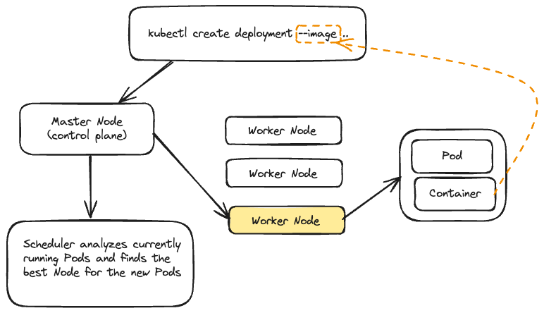

#### Install minikube and kubectl
1. `brew install minikube`
2. `brew install kubectl`
3. `kubectl version --client`

#### Install a hypervisor
1. `brew install podman`


- Run: `minikube start --driver=podman`, could also use `--driver=docker`
`minikube status`

`minikube dashboard`


> Kubernetes works with **Objects** like **Pods**, **Deployments**, **Services**, **Volume**.
> Objects can be created Imperatively and Declaratively

**Pod**:
- The smallest unit Kubernetes interacts with; contains and runs one or multiple containers
- Pods contain shared resouces (volumes) for all Pod containers
- Has a cluster-internal IP by default
- Containers inside a Pod can communicate via localhost
- Pods are design to be `ephemeral`: Kubernetes will start, stop and replace them as needed
- For Pods to be managed for you, you need a "Controller" (e.g a `Deployment`)
- We then create controllers that will create pods for us

**Deployment**
- Controls (multiple) Pods
- You set a desired state, Kubernetes then changes the actual state
- Define which Pods and containers to run and the number of instances
- Deployments can be paused, deleted and rolled back
- Deployments can be scaled dynamically (and automatically)
- Deployments manage a Pod for you, you can also create multiple deployments. (`One kind of Pod` (e.g a Pod with two specific containers). Multiple instances of that Pod are possible)
- You therefore don't directly control Pods, instead you use Deployments to set up the desired end state

###  Deployment - Imperative Approach

- We still need to use Docker to create an image of the application

1. `docker build -t kub-first-app .`
2. We want to send this image to kubernetes to create the pod for us (through the controller)
`minikube status`

3. Create a new deployment object 
   > We should specify and image that is part of an image registry like dockerhub, we can't send it as a local image:
`kubectl create deployment first-app --image=kub-first-app` (will fail)
1. On your dockerhub account, create a repo `kub-first-app`
2. `docker tag kub-first-app jpcaico/kub-first-app`
3. `docker push jpcaico/kub-first-app`
4. `kubectl create deployment first-app --image=jpcaico/kub-first-app`
5. `kubectl get deployments`
6. `kubectl get pods`
> `kubectl delete deployment first-app` (if we need to)

`minikube dashboard`

#### Behind the scenes



**Service**

- Responsible for exposing Pods to other pods in the cluster, or to visitors outside of the cluster
- Podshave an internal IP by default - it changes when a Pod is replaced
- Finding Pods is hard if the IP changes all the time
- Services group Pods with a shared IP (that won't change)
- Services can allow external access to Pods
- The default (internal only) can be overwritten
- Without services, Pods are very hard to reach and communication is difficult
- Reaching a Pod from outside the cluster is not possible at all without services

**Exposing the a Deployment with a Service**

- ClusterIP only be reacheable from inside the cluster
- NodePort this deployment should be exposed with help of Ip address of the worker node, can be access from the outside
- LoadBalancer distributes the load between the workers (only available if your infrastructure supports it, minikube supports it)

`kubectl expose deployment first-app --type=LoadBalancer --port=8080`

`kubectl get services`

`minikube service first-app` to get an address to access the application


If we dont have autoscaling in place but we have more traffic incoming

`kubectl scale deployment/first-app --replicas=3`

`kubectl get pods`

`kubectl scale deployment/first-app --replicas=1`

**Updating deployments**
1. change `app.js` source code
2. Rebuild image
`docker build -t jpcaico/first-app .`
`docker push jpcaico/kub-first-app`
3. update deployment to take new image
`kubectl get deployments`
`kubectl set image deployment/first-app kub-first-app=jpcaico/kub-first-app`
`kubectl get deployments` -- no differences, only if images have a new tag
`docker build -t jpcaico/kub-first-app:2 .`
`docker push jpcaico/kub-first-app:2`
`kubectl set image deployment/first-app kub-first-app=jpcaico/kub-first-app:2`
`kubectl rollout status deployment/first-app`

**Deployment Rollback & history**
Try something that will fail:
`kubectl set image deployment/first-app kub-first-app=jpcaico/kub-first-app:3`

`kubectl rollout status deployment/first-app`
it will not shutdown the old pod until the new pod is up and running

rollback the update so kubernets do not keep with it
`kubectl get pods`

`kubectl rollout undo deployment/first-app` (undo the latest deployment)

get back to older deployments

`kubectl rollout history deployment/first-app`
`kubectl rollout history deployment/first-app --revision=3`

`kubectl rollout undo deployment/first-app --to-revision=1`

**delete service and deployment**

`kubectl delete service first-app`
`kubectl delete deployment first-app`

### Deployment - Declarative approach
- Use yaml files
- `kubectl apply -f=config.yaml`


```

apiVersion: apps/v1
kind: Deployment
metadata:
  name: second-app-deployment
spec:
  replicas: 1
  selector:
    matchLabels:
      app: second-app
      tier: backend
  template:
    metadata:
      labels:
        app: second-app
        tier: backend
    spec:
      containers:
        - name: second-node
          image: jpcaico/kub-first-app:2
```

- a config file is defined and applied to change the desired state
- Comparable to using Docker Compose with compose files
- Now having the `.yaml` file, run

`kubectl apply -f=deployment.yaml`
`kubectl get deployments`
`kubectl get pods`

 **Creating the Service resource**

```
apiVersion: v1
kind: Service
metadata:
  name: backend
spec:
  selector:
    app: second-app
    tier: backend
  ports:
    - protocol: 'TCP'
      port: 80
      targetPort: 8080
  type: LoadBalancer
  ```

`kubectl apply -f service.yaml`
`minikube service backend`

**Updating and Deleting Resources**

1 -  you can simply modify the file, reapply it and it will be applied to your cluster
e.g, change the number of replicas

```
apiVersion: apps/v1
kind: Deployment
metadata:
  name: second-app-deployment
spec:
  replicas: 1
  selector:
    matchLabels:
      app: second-app
      tier: backend
  template:
    metadata:
      labels:
        app: second-app
        tier: backend
    spec:
      containers:
        - name: second-node
          image: jpcaico/kub-first-app:2
```


`kubectl apply -f=deployment.yaml`

`kubectl get pods`

To delete you could delete it imperatively, or:

`kubectl delete -f=deployment.yaml,service.yaml` or
`kubectl delete -f=deployment.yaml -f=service.yaml`

**Multiple vs Single Config Files**

Append the files in a single file, using a `---` separator, like the `master-deployment.yaml`

Put the service first for best practice, since it is deployed in order.


**Delete deployment by label**

`kubectl delete deployments,services -l group=example`

