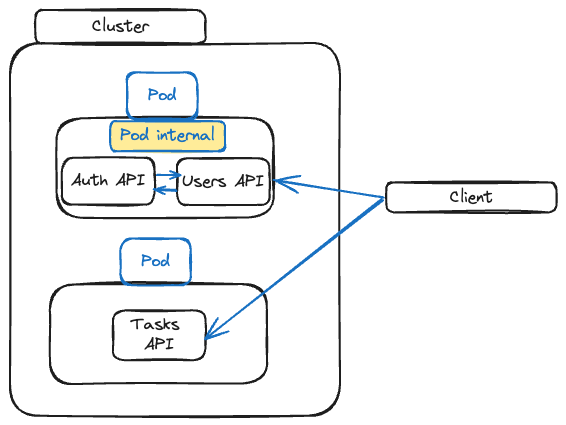
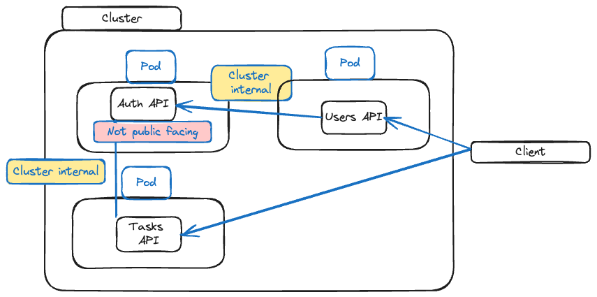

## Kubernetes Networking

First goal





Starting with making sure Users API can handle incoming requests.

1. build image and move to dockerhub
`cd users-api`
`docker build -t jpcaico/kub-demo-users .`
`docker push jpcaico/kub-demo-users`

Create `users-deployment.yaml`

```
apiVersions: apps/v1
kind: Deployment
metadata:
  name: users-deployment
spec:
  replicas: 1
  selector:
    matchLabels:
      app: users
  template:
    metadada:
      labels:
        app: users
    spec:
      containers:
        - name: users
          image: jpcaico/kub-demo-users
```
`cd ..`
`cd kubernetes`
`kubectl apply -f=users-deployment.yaml`

**Adding the service to reach users API**

`users-service.yaml`

```
apiVersion: v1
kind: Service
metadata:
  name: users-service
spec:
  selector:
    app: users
  type: LoadBalancer
  ports:
    - protocol: 'TCP'
      port: 8080
      targetPort: 8080
```
`kubectl apply -f=users-service.yaml`

`minikube service users-service`

```

http://127.0.0.1:61761/login

POST REQUEST - raw - json
{
    "email":"test@test.com",
    "password": "Testers"
}

```

**Multiple containers in a Pod**

`cd auth-api`
`docker build -t jpcaico/kub-demo-auth .`
`docker push jpcaico/kub-demo-auth`

Modify `users-deployment` to add a new container

```
apiVersion: apps/v1
kind: Deployment
metadata:
  name: users-deployment
spec:
  replicas: 1
  selector:
    matchLabels:
      app: users
  template:
    metadata:
      labels:
        app: users
    spec:
      containers:
        - name: users
          image: jpcaico/kub-demo-users:latest
        - name: auth
          image: jpcaico/kub-demo-auth:latest

```
rebuild users image since we changed stuff

`docker build -t jpcaico/kub-demo-users .`
`docker push jpcaico/kub-demo-users`

**Pod internal communication**
For pod internal communication, when 2 containers run in the same pod, kubernetes allow you to send the request to the localhost address and use the port which is exposed by the container.


**Creating multiple Deployments**




user and auth should no longer run in the same Pod

create new `auth-deployment.yaml`

```
apiVersion: apps/v1
kind: Deployment
metadata:
  name: auth-deployment
spec:
  replicas: 1
  selector:
    matchLabels:
      app: auth
  template:
    metadata:
      labels:
        app: auth
    spec:
      containers:
        - name: auth
          image: jpcaico/kub-demo-auth:latest
```

Also remove the `auth` container from the `user-deployment`
```
apiVersion: apps/v1
kind: Deployment
metadata:
  name: users-deployment
spec:
  replicas: 1
  selector:
    matchLabels:
      app: users
  template:
    metadata:
      labels:
        app: users
    spec:
      containers:
        - name: users
          image: jpcaico/kub-demo-users:latest
          env:
            - name: AUTH_ADDRESS
              value: localhost

```
create `auth-service.yaml`

```
apiVersion: v1
kind: Service
metadata:
  name: auth-service
spec:
  selector:
    app: auth
  type: ClusterIP # not be reacheable from the outside
  ports:
    - protocol: 'TCP'
      port: 80
      targetPort: 80
```

how to access now the address from users-service?

**Pod-to-Pod communication with IP Addresses & Environment Variables**

`kubectl apply -f=auth-service.yaml -f=users-service.yaml`

`kubectl get services`

```
NAME            TYPE           CLUSTER-IP       EXTERNAL-IP   PORT(S)          AGE
auth-service    ClusterIP      10.108.216.129   <none>        80/TCP           17s
```

get `10.108.216.129` and insert into `users-deployment.yaml`

`kubectl apply -f=users-deployment.yaml`

but manually getting it is annoying

automatically generated environment variables
`AUTH_SERVICE_SERVICE_HOST`

`docker build -t jpcaico/kub-demo-users .`

`kubectl apply -f=users-deployment.yaml`

**Using DNS for Pod-to-Pod Communication**

- More convenient

change user deployment

`kubectl get namespaces`

```
apiVersion: apps/v1
kind: Deployment
metadata:
  name: users-deployment
spec:
  replicas: 1
  selector:
    matchLabels:
      app: users
  template:
    metadata:
      labels:
        app: users
    spec:
      containers:
        - name: users
          image: jpcaico/kub-demo-users:latest
          env:
            - name: AUTH_ADDRESS
              #value: "10.108.216.129"
              value: "auth-service.default"
```
`kubectl apply -f=users-deployment.yaml`
