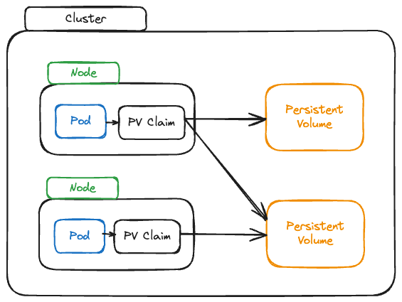

Spin up `docker-compose`

`docker-compose up -d --build`

Test the API in postman

`GET localhost:story`
`POST localhost:story` -> `Body` -> `raw` -> `{"text":"my text!"}`

`docker-compose down`

`docker container prune`

`docker-compose up -d --build` : data still persisted here since we have volume in docker

___

## Kubernetes & Volumes

- Kubernetes can mount Volumes into Containers
- Supports a broad variety of volume types / drivers
  - Local volumes (i.e on Nodes), Cloud-provider specific Volumes
- Volume lifetime depends on Pod lifetime; Volumes are pod specific
- Volumes survive Container restarts (and removal)
- Volumes are removed when Pods are destroyed (So they are not necessarily persistent)

Create `deployment.yaml` and `service.yaml`

Create the repo in dockerhub and push image

`docker build -t jpcaico/kub-data-demo .` 

`docker push jpcaico/kub-data-demo`

`minikube status`

`kubectl apply -f=service.yaml -f=deployment.yaml`

`minikube service story-service`

Now use in postman
`http://192.168.58.2:32678/story`

Problem starts when our container are restarted, we need then to use kubernetes volumes to store data out of the container

**emptyDir**

> It creates an empty directory whenever the Pod starts and keeps this directory alive and filled with data as long as the Pod is alive. Containers can write to this directory, and if container is restarted, the directory is still alive. If the pod is removed than the directory is removed.


We've modified the `app.js` to include the `error` endpoint

`docker build -t jpcaico/kub-data-demo:1 .`
`docker push jpcaico/kub-data-demo:1`

modify `deployment.yaml` to read `:1` image

```
apiVersion: apps/v1
kind: Deployment
metadata:
  name: story-deployment
spec:
  replicas: 1
  selector:
    matchLabels:
      app: story
  template:
    metadata:
      labels:
        app: story
    spec:
      containers:
        - name: story
          image: jpcaico/kub-data-demo:1
```

`kubectl apply -f=deployment.yaml`

now if we send
POST, GET, data is there,  and then GET to `/error`, then GET again, data is deleted.
Container restarted, but Pod is there still.

So we need the volume:

```apiVersion: apps/v1
kind: Deployment
metadata:
  name: story-deployment
spec:
  replicas: 1
  selector:
    matchLabels:
      app: story
  template:
    metadata:
      labels:
        app: story
    spec:
      containers:
        - name: story
          image: jpcaico/kub-data-demo:1
          volumeMounts:
            - mountPath: /app/story
              name: story-volume
      volumes:
        - name: story-volume
          emptyDir: {}
```

`kubectl apply -f=deployment.yaml`

**hostPath** 

If we have more than one container, like `replicas=2` , and one fails, the traffic is be redirected to the other one and temporarily the data will be lost.

A hostPath volume mounts a file or directory from the node's filesystem into your Pod. In the node, the real machine.
Multiple pods can share the same path on the host machine.

```apiVersion: apps/v1
kind: Deployment
metadata:
  name: story-deployment
spec:
  replicas: 2
  selector:
    matchLabels:
      app: story
  template:
    metadata:
      labels:
        app: story
    spec:
      containers:
        - name: story
          image: jpcaico/kub-data-demo:1
          volumeMounts:
            - mountPath: /app/story
              name: story-volume
      volumes:
        - name: story-volume
          hostPath: 
            path: /data
            type: DirectoryOrCreate
            
```

`kubectl apply -f=deployment.yaml`

Only the pods on the **same node** will have access to this data. 

**CSI**
Container Storage Interface defines a standard interface for container orchestration systems to expose arbitrary storage systems to their cntainer workloads

#### From Volumes to Persistent Volumes

Volumes are destroyed when a Pod is removed.
hostPath partially works around that in "One-Node" environments
Pod and Node-independent Volumes are sometimes required

Persistent volumes are pod and node independent
in Persistent Volume will be detached from the Pod, including a total detachment from the Pod lifecycle

Define it once and use in multiple pods if we want to



create the persistent volume 

```
apiVersion: v1
kind: PersistentVolume
metadata:
  name: host-pv
spec:
  capacity:
    storage: 1Gi
  volumeMode: Filesystem
  accessModes:
    - ReadWriteOnce
  hostPath:
    path: /data
    type: DirectoryOrCreate
```

define the persistent volume claim

```
apiVersion: v1
kind: PersistentVolume
metadata:
  name: host-pv
spec:
  capacity:
    storage: 1Gi
  volumeMode: Filesystem
  accessModes:
    - ReadWriteOnce
  hostPath:
    path: /data
    type: DirectoryOrCreate
```

modify `deployment` so the Pod uses the persistent Volume:

```
apiVersion: apps/v1
kind: Deployment
metadata:
  name: story-deployment
spec:
  replicas: 2
  selector:
    matchLabels:
      app: story
  template:
    metadata:
      labels:
        app: story
    spec:
      containers:
        - name: story
          image: jpcaico/kub-data-demo:1
          volumeMounts:
            - mountPath: /app/story
              name: story-volume
      volumes:
        - name: story-volume
          persistentVolumeClaim:
            claimName: host-pvc
```

`kubectl get sc` for storage classes

add `storageClassName: standard` to `host-pvc` and `host-pv`

`kubectl apply -f=host-pv.yaml`
`kubectl apply -f=host-pvc.yaml`
`kubectl apply -f=deployment.yaml`
`kubectl get pv`
`kubectl get pvc`
`kubectl get deployments`

### "Normal" vs Persistent Volumes

- Volumes allow you to persist data (both)

**Normal volumes**
- Volume is attached to Pod and Pod lifecycle
- Defined and created together with the Pod
- Repetitive and hard to administer on a global level


**Persistent volumes**
- Volume is a standalone Cluster resource (NOT attached to a Pod)
- Created standalone, claimed via a PVC
- Can be defined once and used multiple times

### Environment Variables

change in `app.js` the folder name to `process.env.STORY_FOLDER`

change `deployment.yaml`

```
apiVersion: apps/v1
kind: Deployment
metadata:
  name: story-deployment
spec:
  replicas: 2
  selector:
    matchLabels:
      app: story
  template:
    metadata:
      labels:
        app: story
    spec:
      containers:
        - name: story
          image: jpcaico/kub-data-demo:2
          volumeMounts:
            - mountPath: /app/story
              name: story-volume
          env:
            - name: STORY_FOLDER
              value: 'story'
      volumes:
        - name: story-volume
          persistentVolumeClaim:
            claimName: host-pvc


```

`docker build -t jpcaico/kub-data-demo:2 .`
`docker push jpcaico/kub-data-demo:2`
`kubectl apply -f=deployment.yaml`

**Config Map**
create `environment.yaml`

```
apiVersion: v1
kind: ConfigMap
metadata:
  name: data-store-env
data:
  folder: 'story'
```

`kubectl apply -f=environment.yaml`
`kubectl get configmap`

change `deployment.yaml`

```
apiVersion: apps/v1
kind: Deployment
metadata:
  name: story-deployment
spec:
  replicas: 2
  selector:
    matchLabels:
      app: story
  template:
    metadata:
      labels:
        app: story
    spec:
      containers:
        - name: story
          image: jpcaico/kub-data-demo:2
          volumeMounts:
            - mountPath: /app/story
              name: story-volume
          env:
            - name: STORY_FOLDER
              valueFrom: 
                configMapKeyRef:
                  name: data-store-env
                  key: folder
      volumes:
        - name: story-volume
          persistentVolumeClaim:
            claimName: host-pvc


```

`kubectl apply -f=deployment.yaml`